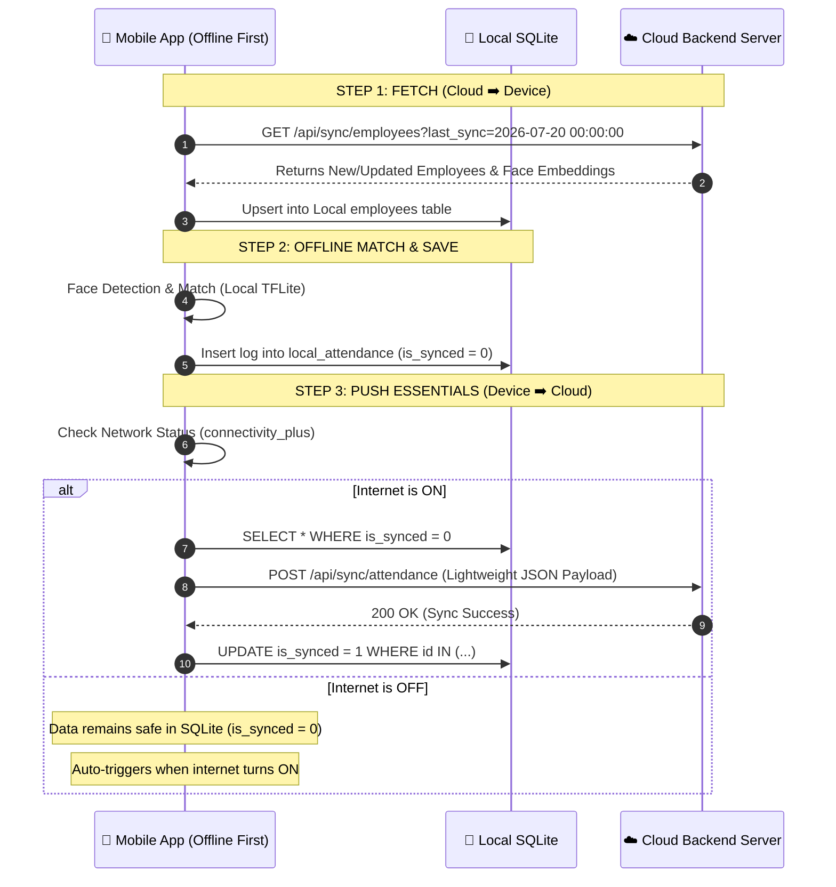

# 🔄 Selective Dual-Sync Architecture (Offline-First Lightweight Sync)

Is document me explain kiya gaya hai ki kaise **Local Database (SQLite)** me sara heavy data rakha jaye, aur **Cloud Database** par sirf zaroori (essential) data bhej kar/fetch kar sync maintain kiya jaye.

---

## 📊 1. Data Split (Local vs Cloud Data Mapping)

### 📱 A. Local Database (Mobile Device SQLite)
Device par fast local face recognition aur offline storage ke liye:
- `employees` table: Local cached copy of all employees + 512-dim face embeddings.
- `local_attendance` table: Full detailed logs (including local photo snapshot path, liveness EAR score, debug logs).

```sql
CREATE TABLE local_attendance (
    id INTEGER PRIMARY KEY AUTOINCREMENT,
    emp_id TEXT NOT NULL,
    emp_name TEXT NOT NULL,
    department TEXT NOT NULL,
    punch_time TEXT NOT NULL,
    punch_type TEXT NOT NULL,         -- 'IN' or 'OUT'
    confidence REAL,
    status TEXT NOT NULL,             -- 'PRESENT', 'LATE'
    local_photo_path TEXT,            -- Mobile me local snapshot image path (NOT sent to cloud)
    is_synced INTEGER DEFAULT 0       -- 0 = Pending, 1 = Synced to Cloud
);
```

### ☁️ B. Cloud Database (Server / PostgreSQL / Firebase)
Server par bandwidth aur space bachaane ke liye sirf essential summary metrics send kiye jaate hain:

```sql
CREATE TABLE cloud_attendance_logs (
    id UUID PRIMARY KEY,
    emp_id TEXT NOT NULL,
    punch_time TIMESTAMP NOT NULL,
    punch_type VARCHAR(10) NOT NULL,  -- 'IN' or 'OUT'
    status VARCHAR(20) NOT NULL,      -- 'PRESENT', 'LATE'
    confidence REAL,
    synced_at TIMESTAMP DEFAULT CURRENT_TIMESTAMP
);
```

---

## 🔄 2. Two-Way Selective Sync Engine (Fetch & Push Workflow)



---

## 📦 3. Essential Payload Structure (Lightweight JSON)

Mobile app se server par bhejte waqt photo files (Heavy MBs) send nahi hoti, sirf 100 bytes ka lightweight JSON bheja jata hai:

### Push Payload (Device ➡️ Cloud API):
```json
{
  "device_id": "TAB_DOOR_01",
  "sync_time": "2026-07-20T15:05:00Z",
  "records": [
    {
      "local_id": 101,
      "emp_id": "EMP005",
      "punch_time": "2026-07-20 09:14:22",
      "punch_type": "IN",
      "status": "PRESENT",
      "confidence": 0.97
    }
  ]
}
```

### Fetch Payload (Cloud ➡️ Device API):
```json
{
  "server_time": "2026-07-20T15:05:00Z",
  "total_employees": 2,
  "employees": [
    {
      "emp_id": "EMP005",
      "name": "Rahul Sharma",
      "department": "Engineering",
      "embedding": [0.012, -0.045, 0.118, "...", 512_dimensions]
    }
  ]
}
```

---

## 💡 Benefits Of Selective Sync

1. **Ultra Fast Attendance**: Server ya internet speed slow hone par bhi 0.2 second me instant attendance mark ho jaati hai.
2. **Minimal Data Usage**: Mobile data (4G/5G) par heavy photos upload nahi hongi, sirf lightweight JSON status bhej kar 99% bandwidth save hoti hai.
3. **Zero Data Loss**: Intermittent/Kharab internet connections par bhi local SQLite buffer me saara data safe rehta hai.
